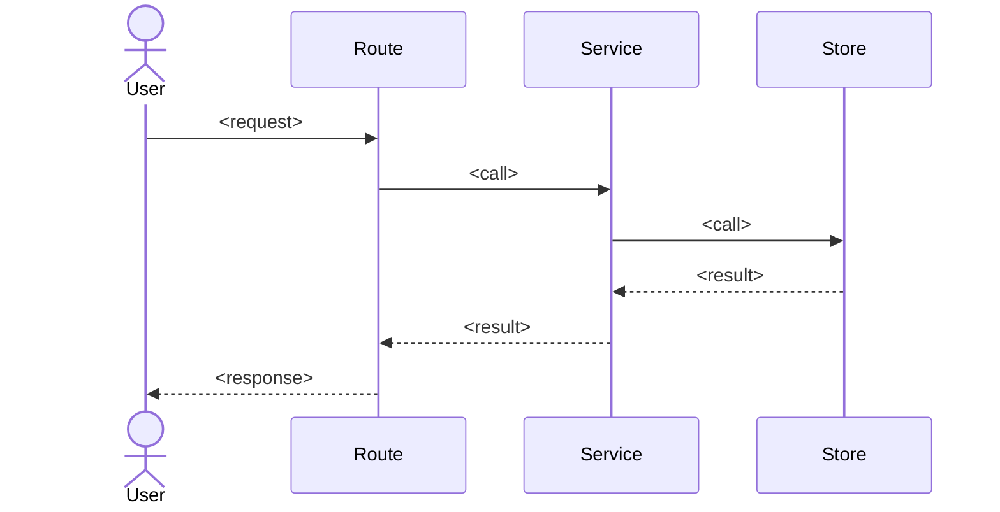

# Spec-Feature Skill

**Trigger paths**: `docs/specs/**`
**Trigger keywords**: spec, interview, feature request, requirements, spec out, define feature, what should X do

---

## Purpose

Before writing a plan or any code, capture requirements and design through a structured two-phase interview. The output is three files under `docs/specs/<feature>/`: `requirements.md`, `design.md`, and `tasks.md`.

---

## EARS notation guide

```
EARS (Easy Approach to Requirements Syntax) — five stems:
  Ubiquitous:   The system shall <action>.
  Event-driven: When <trigger>, the system shall <action>.
  Unwanted:     If <condition>, then the system shall <action>.
  State-driven: While <state>, the system shall <action>.
  Optional:     Where <feature included>, the system shall <action>.
Use "When … the system shall …" for the majority of API feature stories.
Never combine two stems in one sentence.
```

---

## Interview — Phase 1: Requirements (questions 1–5)

Ask these questions **one at a time** (wait for the answer before asking the next):

1. **Actor** — Who uses it? Which user role or system trigger?
2. **Behaviour** — What must it do? Use EARS stem: "When [condition], the system shall [behaviour]." (1–3 stories)
3. **Motivation** — Why now? What is the business motivation and cost of deferral?
4. **Acceptance criteria** — List 3–5 specific, testable conditions that mean "done". Format: "Given / When / Then."
5. **NFRs + success metrics** — Latency target, auth/authz scope, error observability, and one measurable KPI.

After question 5:

- Write `docs/specs/<feature>/requirements.md` (see template below).
- Show the path to the user.
- Ask:
  > "Does this capture the requirements correctly? Reply **yes** to continue to design, or correct anything above."
- **Do not proceed to phase 2 until the user replies yes.**

---

## Interview — Phase 2: Design (questions 6–8)

Ask these questions **one at a time** (wait for the answer before asking the next):

6. **API shape** — HTTP method(s), path(s), request fields, response fields.
7. **Data model** — Entity fields and types (no code); relations to existing models.
8. **Technical constraints** — Anything limiting implementation beyond project defaults (stack limits, third-party APIs, etc.).

After question 8:

- Write `docs/specs/<feature>/design.md` (see template below).
- Immediately write `docs/specs/<feature>/tasks.md` (see template below).

Final message (exact string):
```
Spec written to docs/specs/<feature>/ — run /plan <feature> to produce the implementation plan.
```

---

## Output templates

### `requirements.md`

```markdown
# Requirements: <feature name>

**Date**: <YYYY-MM-DD>
**Author**: <from git config user.name>
**Status**: approved

## Actor
<who triggers this feature>

## Motivation
<why now — business motivation and cost of not building>

## User stories (EARS)
- When <condition>, the system shall <behaviour>.
- ...

## Acceptance criteria
- [ ] Given <state>, when <action>, then <outcome>
- [ ] ...

## Non-functional requirements
- **Performance**: <latency target>
- **Security**: <auth/authz scope>
- **Observability**: <error logging / tracing hooks>

## Success metrics / KPIs
- <measurable metric, not a checkbox>

## Out of scope
- <explicitly excluded items>

## Open questions
- <anything unresolved from phase 1>
```

### `design.md`

```markdown
# Design: <feature name>

## API contracts

| Method | Path | Request | Response | Status codes |
|---|---|---|---|---|
| <METHOD> | <path> | <fields> | <fields> | 200, 404, 422 |

## Pydantic model sketches

**<ModelName>**
- `<field>`: `<type>`
- ...

## BCE layer decisions
- **Route**: <what the route handles>
- **Service/Control**: <what business logic lives here>
- **Store/Entity**: <what the store layer owns>

## Sequence diagram



## Technical constraints
- Stack: FastAPI, Pydantic v2, uv, Python 3.11+, mypy --strict
- <additional constraints from user>
```

### `tasks.md`

```markdown
# Tasks: <feature name>

Ordered commit checklist — implement in this sequence:

- [ ] **models** — define Pydantic models in `src/app/models/<feature>.py`
- [ ] **store** — implement persistence layer in `src/app/store/<feature>.py`
- [ ] **routes** — implement route handlers in `src/app/routes/<feature>.py`; wire into `main.py`
- [ ] **tests** — write happy path, 422, and 404 tests in `tests/test_<feature>.py`
- [ ] run `/plan <feature>` to produce the implementation plan
```

---

## Rules

- Never invent requirements — only write what the user confirmed.
- Ask questions one at a time; never batch multiple questions in one message.
- Do not proceed to phase 2 until the user explicitly approves `requirements.md`.
- "Open questions" in `requirements.md` must list anything unresolved after phase 1.
- Do not start the plan or write any code.
